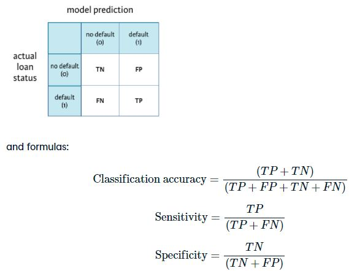

```{r include=FALSE}

library(gmodels)
library(tidyverse)

loan_data <- readRDS("loan_data_ch1.rds")
bb <- readRDS("loan_data_ch2.rds")
```


This hands-on-course with real-life credit data will teach you how to model credit risk by using logistic regression and decision trees in R.

Modeling credit risk for both personal and company loans is of major importance for banks. The probability that a debtor will default is a key component in getting to a measure for credit risk. While other models will be introduced in this course as well, you will learn about two model types that are often used in the credit scoring context; logistic regression and decision trees. You will learn how to use them in this particular context, and how these models are evaluated by banks.

## 1-2 Exploring the credit data

We will be examining the dataset loan_data discussed in the video throughout the exercises in this course.

After being given loan_data, you are particularly interested about the defaulted loans in the data set. You want to get an idea of the number, and percentage of defaults. Defaults are rare, so you always want to check what the proportion of defaults is in a loan dataset. The CrossTable() function is very useful here.

Remember that default information is stored in the response variable loan_status, where 1 represents a default, and 0 represents non-default.

To learn more about variable structures and spot unexpected tendencies in the data, you should examine the relationship between loan_status and certain factor variables. For example, you would expect that the proportion of defaults in the group of customers with grade G (worst credit rating score) is substantially higher than the proportion of defaults in the grade A group (best credit rating score).

Conveniently, CrossTable() can also be applied on two categorical variables. Let's explore!

```{r}
# View the structure of loan_data
str(loan_data)

# Call CrossTable() on loan_status
CrossTable(loan_data$loan_status)

# Call CrossTable() on grade and loan_status
CrossTable(loan_data$grade, loan_data$loan_status, prop.r = TRUE, prop.c = FALSE, prop.t = FALSE, prop.chisq = FALSE)
```


## 1-5 Histograms

The data set loan_data is loaded in your workspace. You previously explored categorical variables using the CrossTable() function. Now you would like to explore continuous variables to identify potential outliers or unexpected data structures.

To do this, let's experiment with the function hist() to understand the distribution of the number of loans for different customers.

```{r}
loan_data %>% ggplot(aes(loan_amnt))+ geom_histogram(bins = 30)+
  labs(x = "Loan amount", title = "Histogram of the loan amount")
```


## 1-6 Outliers

Now it's time to look at the structure of the variable age. A histogram is plotted on your right. Similar to what you observed in the video for annual income (annual_inc), there is a lot of blank space on the right-hand side of the plot. This is an indication of possible outliers. You will look at a scatterplot to verify this. If you find any outliers you will delete them.

If outliers are observed for several variables, it might be useful to look at bivariate plots. It's possible the outliers belong to the same observation. If so, there is even more reason to delete the observation because it is more likely that some information stored in it is wrong.

```{r}
# Plot the age variable
loan_data %>% ggplot(aes(as.numeric(rownames(loan_data)), age))+ geom_point()+
  labs(x="Index", y = "Age")
# Save the outlier's index to index_highage
index_highage <- which(loan_data$age > 122)

# Create data set new_data with outlier deleted
new_data <- loan_data[-index_highage, ]

# Make bivariate scatterplot of age and annual income

loan_data %>% ggplot(aes(age, annual_inc))+ geom_point()+
  labs(x="Age", y = "Annual Income")
```


## 1-8 Deleting missing data

You saw before that the interest rate (int_rate) in the data set loan_data depends on the customer. Unfortunately some observations are missing interest rates. You now need to identify how many interest rates are missing and then delete them.

In this exercise you will use the function which() to create an index of rows that contain an NA. You will then use this index to delete rows with NAs.

```{r}
library(naniar)
vis_miss(loan_data)
```

```{r}
# Look at summary of loan_data
 summary(loan_data$int_rate)

# Get indices of missing interest rates: na_index
na_index <- which(is.na(loan_data$int_rate))

# Remove observations with missing interest rates: loan_data_delrow_na
loan_data_delrow_na <- loan_data[-na_index, ]

# Make copy of loan_data
loan_data_delcol_na <- loan_data

# Delete interest rate column from loan_data_delcol_na
loan_data_delcol_na$int_rate <- NULL
```


## 1-9 Replacing missing data

Rather than deleting the missing interest rates, you may want to replace them instead. The object na_index, which contains the index of the observations with missing interest rates is still loaded in your workspace.

```{r}
# Compute the median of int_rate
median_ir <- median(loan_data$int_rate, na.rm=TRUE)

# Make copy of loan_data
loan_data_replace <- loan_data

# Replace missing interest rates with median
loan_data_replace$int_rate[which(is.na(loan_data$int_rate))] <- median_ir

# Check if the NAs are gone
summary(loan_data_replace$int_rate)
```


## 1-10 Keeping missing data

In some situations, the fact that an input is missing is important information in itself. NAs can be kept in a separate "missing" category using coarse classification.

Coarse classification allows you to simplify your data and improve the interpretability of your model. Coarse classification requires you to bin your responses into groups that contain ranges of values. You can use this binning technique to place all NAs in their own bin.

In the video, we illustrated the idea of coarse classification for employment length. The code from that example has been reproduced in the R script to the right and can be adapted to coarse classify the int_rate variable.

```{r}
# Make the necessary replacements in the coarse classification example below 
loan_data$ir_cat <- rep(NA, length(loan_data$int_rate))

loan_data$ir_cat[which(loan_data$int_rate <= 8)] <- "0-8"
loan_data$ir_cat[which(loan_data$int_rate > 8 & loan_data$int_rate <= 11)] <- "8-11"
loan_data$ir_cat[which(loan_data$int_rate > 11 & loan_data$int_rate <= 13.5)] <- "11-13.5"
loan_data$ir_cat[which(loan_data$int_rate > 13.5)] <- "13.5+"
loan_data$ir_cat[which(is.na(loan_data$int_rate))] <- "Missing"

loan_data$ir_cat <- as.factor(loan_data$ir_cat)

# Look at your new variable using plot()
plot(loan_data$ir_cat)
```


## 1-12 Splitting the data set

To make your training and test sets, you should first set a seed using set.seed(). Seeds allow you to create a starting point for randomly generated numbers, so that each time your code is run the same answer is generated. The advantage of doing this in your sampling is that you or anyone else can recreate the exact same training and test sets by using the same seed.

Using sample(), you can randomly assign observations to the training and test set.

For this exercise you will use the two first arguments in the sample() function:

The first argument is the vector from which we will sample values. We will randomly pick row numbers as indices; you can use 1:nrow(loan_data) to create the vector of row numbers.
The second argument is the number of items to choose. We will enter 2 / 3 * nrow(loan_data), as we construct the training set first.

```{r}
# Set seed of 567
set.seed(567)

# Store row numbers for training set: index_train
index_train <- sample(1:nrow(loan_data), 2 / 3 * nrow(loan_data))

# Create training set: training_set
training_set <- loan_data[index_train, ]

# Create test set: test_set
test_set <- loan_data[-index_train, ]


```


## 1-13 Creating a confusion matrix

In this example, assume that you have run a model and stored the predicted outcomes in a vector called model_pred. You want to see how the model performed so you will construct a confusion matrix. You will compare the actual loan status column (loan_status) to the predicted values (model_pred), using the table() function, where the arguments are the true values and the predicted values. Recall the confusion matrix structure:



```{r}

```


