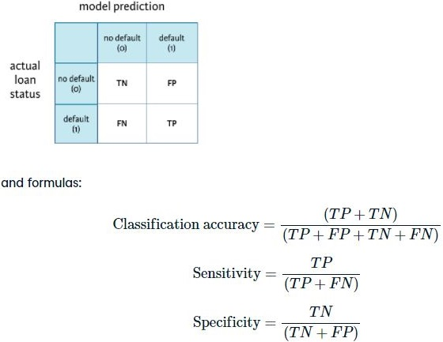

```{r include=FALSE}

library(gmodels)
library(tidyverse)
library(rpart ) # for decision tree

loan_data <- readRDS("loan_data_ch1.rds")
model_pred <- read.csv("model_pred.csv")
bb <- readRDS("loan_data_ch2.rds")
```

This hands-on-course with real-life credit data will teach you how to model credit risk by using logistic regression and decision trees in R.

Modeling credit risk for both personal and company loans is of major importance for banks. The probability that a debtor will default is a key component in getting to a measure for credit risk. While other models will be introduced in this course as well, you will learn about two model types that are often used in the credit scoring context; logistic regression and decision trees. You will learn how to use them in this particular context, and how these models are evaluated by banks.

## 1-2 Exploring the credit data

We will be examining the dataset loan_data discussed in the video throughout the exercises in this course.

After being given loan_data, you are particularly interested about the defaulted loans in the data set. You want to get an idea of the number, and percentage of defaults. Defaults are rare, so you always want to check what the proportion of defaults is in a loan dataset. The CrossTable() function is very useful here.

Remember that default information is stored in the response variable loan_status, where 1 represents a default, and 0 represents non-default.

To learn more about variable structures and spot unexpected tendencies in the data, you should examine the relationship between loan_status and certain factor variables. For example, you would expect that the proportion of defaults in the group of customers with grade G (worst credit rating score) is substantially higher than the proportion of defaults in the grade A group (best credit rating score).

Conveniently, CrossTable() can also be applied on two categorical variables. Let's explore!

```{r}
# View the structure of loan_data
str(loan_data)

# Call CrossTable() on loan_status
CrossTable(loan_data$loan_status)

# Call CrossTable() on grade and loan_status
CrossTable(loan_data$grade, loan_data$loan_status, prop.r = TRUE, prop.c = FALSE, prop.t = FALSE, prop.chisq = FALSE)
```


## 1-5 Histograms

The data set loan_data is loaded in your workspace. You previously explored categorical variables using the CrossTable() function. Now you would like to explore continuous variables to identify potential outliers or unexpected data structures.

To do this, let's experiment with the function hist() to understand the distribution of the number of loans for different customers.

```{r}
loan_data %>% ggplot(aes(loan_amnt))+ geom_histogram(bins = 30, fill="white", color="black")+
  labs(x = "Loan amount", title = "Histogram of the loan amount")
```


## 1-6 Outliers

Now it's time to look at the structure of the variable age. A histogram is plotted on your right. Similar to what you observed in the video for annual income (annual_inc), there is a lot of blank space on the right-hand side of the plot. This is an indication of possible outliers. You will look at a scatterplot to verify this. If you find any outliers you will delete them.

If outliers are observed for several variables, it might be useful to look at bivariate plots. It's possible the outliers belong to the same observation. If so, there is even more reason to delete the observation because it is more likely that some information stored in it is wrong.

```{r}
# Plot the age variable
loan_data %>% ggplot(aes(as.numeric(rownames(loan_data)), age))+ geom_point()+
  labs(x="Index", y = "Age")
# Save the outlier's index to index_highage
index_highage <- which(loan_data$age > 122)

# Create data set new_data with outlier deleted
new_data <- loan_data[-index_highage, ]

# Make bivariate scatterplot of age and annual income

loan_data %>% ggplot(aes(age, annual_inc))+ geom_point()+
  labs(x="Age", y = "Annual Income")
```


## 1-8 Deleting missing data

You saw before that the interest rate (int_rate) in the data set loan_data depends on the customer. Unfortunately some observations are missing interest rates. You now need to identify how many interest rates are missing and then delete them.

In this exercise you will use the function which() to create an index of rows that contain an NA. You will then use this index to delete rows with NAs.

```{r}
library(naniar)
vis_miss(loan_data)
```

```{r}
# Look at summary of loan_data
 summary(loan_data$int_rate)

# Get indices of missing interest rates: na_index
na_index <- which(is.na(loan_data$int_rate))

# Remove observations with missing interest rates: loan_data_delrow_na
loan_data_delrow_na <- loan_data[-na_index, ]

# Make copy of loan_data
loan_data_delcol_na <- loan_data

# Delete interest rate column from loan_data_delcol_na
loan_data_delcol_na$int_rate <- NULL
```


## 1-9 Replacing missing data

Rather than deleting the missing interest rates, you may want to replace them instead. The object na_index, which contains the index of the observations with missing interest rates is still loaded in your workspace.

```{r}
# Compute the median of int_rate
median_ir <- median(loan_data$int_rate, na.rm=TRUE)

# Make copy of loan_data
loan_data_replace <- loan_data

# Replace missing interest rates with median
loan_data_replace$int_rate[which(is.na(loan_data$int_rate))] <- median_ir

# Check if the NAs are gone
summary(loan_data_replace$int_rate)
```


## 1-10 Keeping missing data

In some situations, the fact that an input is missing is important information in itself. NAs can be kept in a separate "missing" category using coarse classification.

Coarse classification allows you to simplify your data and improve the interpretability of your model. Coarse classification requires you to bin your responses into groups that contain ranges of values. You can use this binning technique to place all NAs in their own bin.

In the video, we illustrated the idea of coarse classification for employment length. The code from that example has been reproduced in the R script to the right and can be adapted to coarse classify the int_rate variable.

```{r}
# Make the necessary replacements in the coarse classification example below 
loan_data$ir_cat <- rep(NA, length(loan_data$int_rate))

loan_data$ir_cat[which(loan_data$int_rate <= 8)] <- "0-8"
loan_data$ir_cat[which(loan_data$int_rate > 8 & loan_data$int_rate <= 11)] <- "8-11"
loan_data$ir_cat[which(loan_data$int_rate > 11 & loan_data$int_rate <= 13.5)] <- "11-13.5"
loan_data$ir_cat[which(loan_data$int_rate > 13.5)] <- "13.5+"
loan_data$ir_cat[which(is.na(loan_data$int_rate))] <- "Missing"

loan_data$ir_cat <- as.factor(loan_data$ir_cat)

# Look at your new variable using plot()
loan_data %>% ggplot(aes(ir_cat))+ geom_bar(fill="grey", color="black", width = 0.8)+theme_minimal()
```


## 1-12 Splitting the data set

To make your training and test sets, you should first set a seed using set.seed(). Seeds allow you to create a starting point for randomly generated numbers, so that each time your code is run the same answer is generated. The advantage of doing this in your sampling is that you or anyone else can recreate the exact same training and test sets by using the same seed.

Using sample(), you can randomly assign observations to the training and test set.

For this exercise you will use the two first arguments in the sample() function:

The first argument is the vector from which we will sample values. We will randomly pick row numbers as indices; you can use 1:nrow(loan_data) to create the vector of row numbers.
The second argument is the number of items to choose. We will enter 2 / 3 * nrow(loan_data), as we construct the training set first.

```{r}
# Set seed of 567
set.seed(567)

# Store row numbers for training set: index_train
index_train <- sample(1:nrow(loan_data), 2 / 3 * nrow(loan_data))

# Create training set: training_set
training_set <- loan_data[index_train, ]

# Create test set: test_set
test_set <- loan_data[-index_train, ]

```


## 1-13 Creating a confusion matrix

In this example, assume that you have run a model and stored the predicted outcomes in a vector called model_pred. You want to see how the model performed so you will construct a confusion matrix. You will compare the actual loan status column (loan_status) to the predicted values (model_pred), using the table() function, where the arguments are the true values and the predicted values. Recall the confusion matrix structure:



```{r}
# Create confusion matrix
 conf_matrix <- table(test_set$loan_status, model_pred$x)
conf_matrix
# Compute classification accuracy
(conf_matrix[1,1]+conf_matrix[2,2])/(conf_matrix[1,1]+conf_matrix[2,2]+conf_matrix[2,1]+conf_matrix[1,2])

# Compute sensitivity
conf_matrix[2,2]/(conf_matrix[2,1]+conf_matrix[2,2])
```


## 2-2 Basic logistic regression

In the video, you looked at a logistic regression model including the variable age as a predictor. Now, you will include a categorical variable, and learn how to interpret its parameter estimates.

When you include a categorical variable in a logistic regression model in R, you will obtain a parameter estimate for all but one of its categories. This category for which no parameter estimate is given is called the reference category. The parameter for each of the other categories represents the odds ratio in favor of a loan default between the category of interest and the reference category. Don't worry if this doesn't make complete sense to you yet, you'll do more exercises on this later on!

```{r}
# Build a glm model with variable ir_cat as a predictor
log_model_cat <- glm(loan_status ~ ir_cat, family = "binomial", data = training_set)


# Print the parameter estimates 
log_model_cat

# Look at the different categories in ir_cat using table()
table(loan_data$ir_cat)
```

```{r}
# to access coefficients:
log_model_cat$coefficients
```

## 2-4 Multiple variables in a logistic regression model

The interpretation of a single parameter still holds when including several variables in a model. When you do include several variables and ask for the interpretation when a certain variable changes, it is assumed that the other variables remain constant, or unchanged. There is a fancy latin phrase for this, ceteris paribus, literally meaning "keeping all others the same".

To build a logistic regression model with multiple variables, you can use the + sign to add variables. Your formula will look something like:

y ~ x1 + ... + xk

In order to evaluate the model there are a number of things to be aware of. You already looked at the parameter values, but that is not the only thing of importance. Also important is the statistical significance of a certain parameter estimate. The significance of a parameter is often referred to as a p-value, however in a model output you will see it denoted as Pr(>|t|). In glm, mild significance is denoted by a "." to very strong significance denoted by "***". When a parameter is not significant, this means you cannot assure that this parameter is significantly different from 0. Statistical significance is important. In general, it only makes sense to interpret the effect on default for significant parameters.

```{r}
# Build the logistic regression model
log_model_multi <- glm(loan_status ~ age+ir_cat+grade+loan_amnt+annual_inc, family = "binomial", data = training_set)


# Obtain significance levels using summary()
summary(log_model_multi)
```

## 2-7 Predicting the probability of default

In the video you looked at the predicted probability of default for one case in the test set. Luckily, you can predict the probability for all the test set cases at once using the predict() function.

After having obtained all the predictions for the test set elements, it is useful to get an initial idea of how good the model is at discriminating by looking at the range of predicted probabilities. A small range means that predictions for the test set cases do not lie far apart, and therefore the model might not be very good at discriminating good from bad customers. With low default percentages, you will notice that in general, very low probabilities of default are predicted. It's time to have a look at a first model.

log_model_small is loaded in the workspace.

```{r}

log_model_small <- glm(formula = loan_status ~ age + ir_cat, family = "binomial", data = training_set)

# Build the logistic regression model
predictions_all_small <- predict(log_model_small, newdata = test_set, type = "response")

# Look at the range of the object "predictions_all_small"
range(predictions_all_small)

min(predictions_all_small)
max(predictions_all_small)
```

## 2-8 Making more discriminative models

In the previous exercise, the range for predicted probabilities of default was rather small. As discussed, small predicted default probabilities are to be expected with low default rates, but building bigger models (which basically means: including more predictors) can expand the range of your predictions.

Whether this will eventually lead to better predictions still needs to be validated and depends on the quality of the newly included predictors. But first, have a look at how bigger models can expand the range.

```{r}
# Build the logistic regression model
log_model_full <- glm(loan_status ~ ., family = "binomial", data = training_set)

# Make PD-predictions for all test set elements using the the full logistic regression model
#predictions_all_full <- predict(log_model_full, newdata = test_set, type = "response")

# Look at the predictions range
#range(predictions_all_full)

```


## 2-10 Specifying a cut-off

We have shown you how the specification of a cut-off can make the difference to obtain a good confusion matrix. Now, you will learn how to transform the prediction vector to a vector of binary values indicating the status of the loan. The ifelse() function in R can help you here.

Applying the ifelse() function in the context of a cut-off, you would have something like

ifelse(predictions > 0.3, 1, 0)

In the first argument, you are testing whether a certain value in the predictions-vector is bigger than 0.3. If this is TRUE, R returns "1" (specified in the second argument), if FALSE, R returns "0" (specified in the third argument), representing "default" and "no default", respectively.

```{r}
# The code for the logistic regression model and the predictions is given below
log_model_full <- glm(loan_status ~ ., family = "binomial", data = training_set)

#predictions_all_full <- predict(log_model_full, newdata = test_set, type = "response")

# Make a binary predictions-vector using a cut-off of 15%
#pred_cutoff_15 <- ifelse(predictions_all_full>0.15, 1, 0)

# Construct a confusion matrix
#table(test_set$loan_status, pred_cutoff_15)
```

## 2-13 Comparing link functions for a given cut-off

In this last exercise, you will fit a model using each of the three link functions (logit, probit and cloglog), make predictions for the test set, classify the predictions in the appropriate group (default versus non-default) for a given cut-off, make a confusion matrix and compute the accuracy and sensitivity for each of the models given the cut-off value! Wow, you've learned a lot so far. And finally, you will try to identify the model that performs best in terms of accuracy given the cut-off value!

It is important to know that the differences between the models will generally be very small, and again, the results will depend on the chosen cut-off value. The observed outcome (default versus non-default) is stored in true_val in the console.


```{r }
# Fit the logit, probit and cloglog-link logistic regression models
#log_model_logit <- glm(loan_status ~ age + emp_cat + ir_cat + loan_amnt,
#                      family = binomial(link = logit), data = training_set)
#log_model_probit <- glm(loan_status ~ age + emp_cat + ir_cat + loan_amnt,
#                       family = binomial(link = probit), data = training_set)

#log_model_cloglog <-  glm(loan_status ~ age + emp_cat + ir_cat + loan_amnt,
#                       family = binomial(link = cloglog), data = training_set)
  
# Make predictions for all models using the test set
#predictions_logit <- predict(log_model_logit, newdata = test_set, type = "response")
#predictions_probit <- predict(log_model_probit, newdata = test_set, type = "response")
#predictions_cloglog <- predict(log_model_cloglog, newdata = test_set, type = "response")
  
# Use a cut-off of 14% to make binary predictions-vectors
#cutoff <- 0.14
#class_pred_logit <- ifelse(predictions_logit > cutoff, 1, 0)
#class_pred_probit <- ifelse(predictions_probit > cutoff, 1, 0)
#class_pred_cloglog <- ifelse(predictions_cloglog > cutoff, 1, 0)
  
# Make a confusion matrix for the three models
#tab_class_logit <- table(true_val,class_pred_logit)
#tab_class_probit <- table(true_val,class_pred_probit)
#tab_class_cloglog <- table(true_val,class_pred_cloglog)
  
# Compute the classification accuracy for all three models
#acc_logit <- sum(diag(tab_class_logit)) / nrow(test_set)
#acc_probit <- sum(diag(tab_class_probit)) / nrow(test_set)
#acc_cloglog <- sum(diag(tab_class_cloglog)) / nrow(test_set)
```


